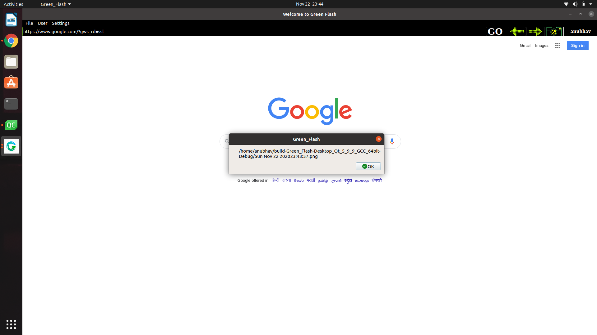
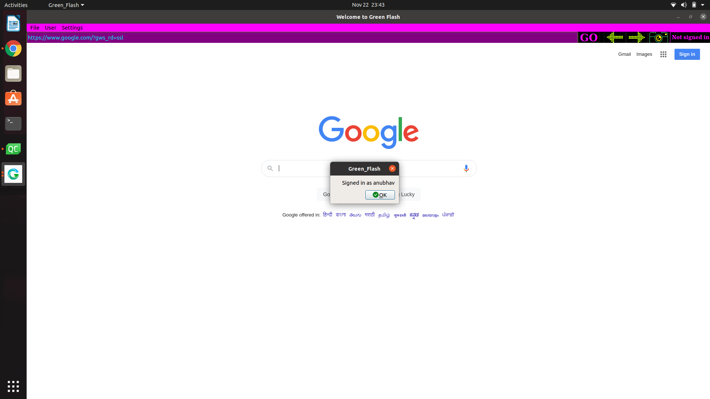

# GREEN-FLASH

Green Flash is a fully functioning C++ based web browser. It uses QT Framework and QT Web Engine.It supports multiple users whose histories are saved discreetly and independently. Its interface currently has 5 themes(default, american flag,moonlight,tropical,magentic ),menu bar,address bar, navigation buttons and quick snapshot button. User data including theme, history, browsing sessions are stored with privacy features, hence are irretrievable, from other parties.

